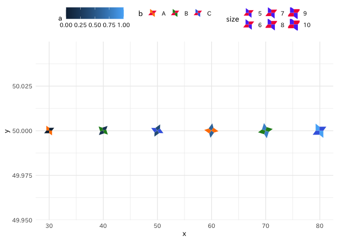
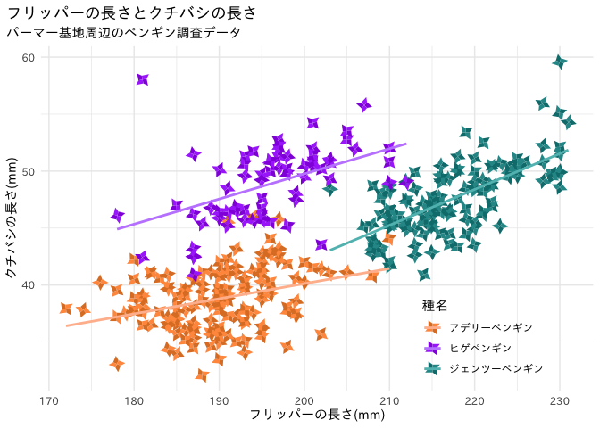
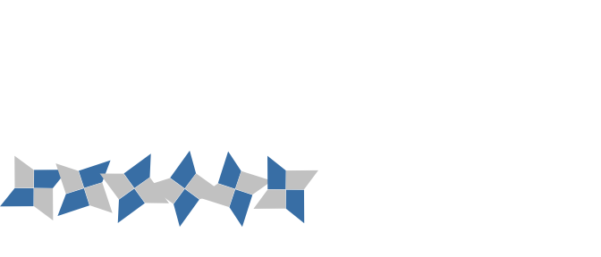
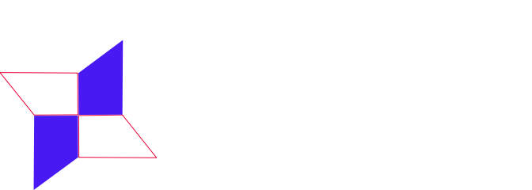
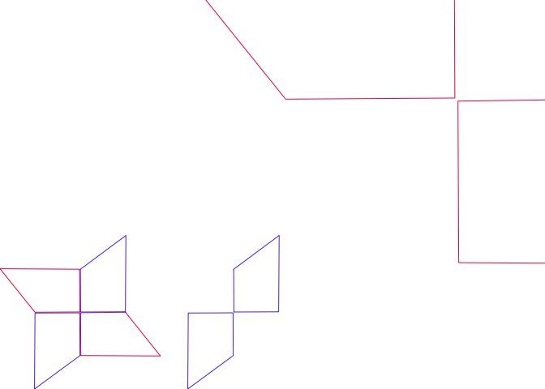
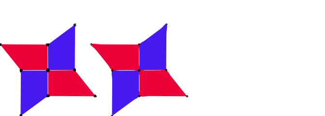
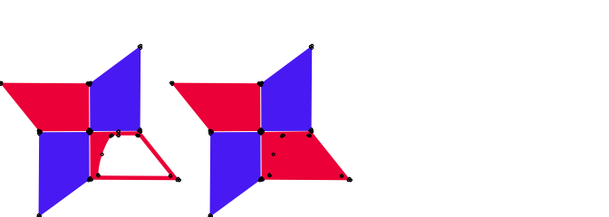

README
================
2024-02-11

# geomsvg

SVGのpath要素をggplotで描画する

### 本文書作成時の環境

- R version 4.3.1 (2023-06-16) Platform: x86_64-apple-darwin20 (64-bit)
  Running under: macOS Ventura 13.5

- パッケージ

  - ggplot2_3.4.4
  - grid_4.3.1
  - scales_1.3.0
  - XML_3.99-0.16

- サンプルで追加で使用するパッケージ

  - colorspace_2.1-0
  - dplyr_1.1.4
  - forcats_1.0.0
  - palmerpenguins_0.1.1

### サンプル

#### ソースファイルロード

``` r
source('./path_reader.R')
source('./geom_svg.R')
```

#### SVGファイルのpath要素をロードする

``` r
path_obj_list <- read.svg.path('./sample_fig.svg')
n_path_obj_list <- normalizeSVGPath(path_obj_list)
str(n_path_obj_list)
```

    ## List of 2
    ##  $ seg1:List of 3
    ##   ..$ style :List of 5
    ##   .. ..$ display     : chr "inline"
    ##   .. ..$ fill        : chr "#f20d46"
    ##   .. ..$ stroke      : chr "#000000"
    ##   .. ..$ stroke-width: chr "0.000835731"
    ##   .. ..$ stop-color  : chr "#000000"
    ##   ..$ bezier:'data.frame':   24 obs. of  9 variables:
    ##   .. ..$ seg_i: num [1:24] 1 1 1 1 1 1 1 1 1 1 ...
    ##   .. ..$ sposx: num [1:24] 0.5 0.48913 0.01017 0.00377 0.00373 ...
    ##   .. ..$ sposy: num [1:24] 0.294 0.294 0.291 0.291 0.283 ...
    ##   .. ..$ sctlx: num [1:24] 0.5 0.48913 0.01017 0.00377 0.00373 ...
    ##   .. ..$ sctly: num [1:24] 0.294 0.294 0.291 0.291 0.283 ...
    ##   .. ..$ dctlx: num [1:24] 0.48913 0.01017 0.00377 0.00373 0.00258 ...
    ##   .. ..$ dctly: num [1:24] 0.294 0.2912 0.2911 0.2832 0.0326 ...
    ##   .. ..$ dposx: num [1:24] 0.48913 0.01017 0.00377 0.00373 0.00258 ...
    ##   .. ..$ dposy: num [1:24] 0.294 0.2912 0.2911 0.2832 0.0326 ...
    ##   ..$ spline:'data.frame':   74 obs. of  4 variables:
    ##   .. ..$ seg_i: num [1:74] 1 1 1 1 1 1 1 1 1 1 ...
    ##   .. ..$ x    : num [1:74] 0.5 0.498 0.491 0.489 0.4 ...
    ##   .. ..$ y    : num [1:74] 0.294 0.294 0.294 0.294 0.294 ...
    ##   .. ..$ s    : num [1:74] -1 1 1 -1 1 1 -1 1 1 -1 ...
    ##  $ seg2:List of 3
    ##   ..$ style :List of 6
    ##   .. ..$ display     : chr "inline"
    ##   .. ..$ fill        : chr "#5c3df5"
    ##   .. ..$ fill-opacity: chr "1"
    ##   .. ..$ stroke      : chr "#000000"
    ##   .. ..$ stroke-width: chr "0.000835742"
    ##   .. ..$ stop-color  : chr "#000000"
    ##   ..$ bezier:'data.frame':   24 obs. of  9 variables:
    ##   .. ..$ seg_i: num [1:24] 1 1 1 1 1 1 1 1 1 1 ...
    ##   .. ..$ sposx: num [1:24] -0.285 -0.285 -0.282 -0.282 -0.273 ...
    ##   .. ..$ sposy: num [1:24] 0.5 0.4902 0.0347 0.026 0.026 ...
    ##   .. ..$ sctlx: num [1:24] -0.285 -0.285 -0.282 -0.282 -0.273 ...
    ##   .. ..$ sctly: num [1:24] 0.5 0.4902 0.0347 0.026 0.026 ...
    ##   .. ..$ dctlx: num [1:24] -0.2848 -0.28177 -0.28171 -0.27292 -0.00821 ...
    ##   .. ..$ dctly: num [1:24] 0.4902 0.0347 0.026 0.026 0.0249 ...
    ##   .. ..$ dposx: num [1:24] -0.2848 -0.28177 -0.28171 -0.27292 -0.00821 ...
    ##   .. ..$ dposy: num [1:24] 0.4902 0.0347 0.026 0.026 0.0249 ...
    ##   ..$ spline:'data.frame':   74 obs. of  4 variables:
    ##   .. ..$ seg_i: num [1:74] 1 1 1 1 1 1 1 1 1 1 ...
    ##   .. ..$ x    : num [1:74] -0.285 -0.285 -0.285 -0.285 -0.284 ...
    ##   .. ..$ y    : num [1:74] 0.5 0.498 0.492 0.49 0.406 ...
    ##   .. ..$ s    : num [1:74] -1 1 1 -1 1 1 -1 1 1 -1 ...

#### ロードしたpathをggplotで描画する

``` r
# define grob
defineGrob(n_path_obj_list, class_name = 'shuriken')
```

    ## <environment: R_GlobalEnv>

``` r
# define geom
defineGeom(n_path_obj_list, class_name = 'shuriken', custom_grob = shurikenGrob)
```

    ## <environment: R_GlobalEnv>

``` r
# show what are defined
ls()[grep('shuriken', ls(), ignore.case = TRUE)]
```

    ##  [1] "geom_shuriken"                       "GeomShuriken"                       
    ##  [3] "makeContent.shuriken"                "scale_shuriken:seg1:fill_continuous"
    ##  [5] "scale_shuriken:seg1:fill_discrete"   "scale_shuriken:seg1:fill_manual"    
    ##  [7] "scale_shuriken:seg2:fill_continuous" "scale_shuriken:seg2:fill_discrete"  
    ##  [9] "scale_shuriken:seg2:fill_manual"     "shurikenGrob"

``` r
library(ggplot2)
theme_set(theme_minimal(base_family = 'IPAexGothic'))
df <- data.frame(
  x = c(30, 40, 50, 60, 70, 80),
  y = rep(50, 6),
  size = seq(5, 10),
  rotation = seq(0, pi/2, pi/10),
  a = seq(0, 1, 1./5),
  b = as.factor(rep(c('A', 'B', 'C'), 2))
)
ggplot(df) +
  geom_shuriken(
    aes(x, y, size = size, rotation = rotation, `seg1:fill` = a, `seg2:fill` = b)) +
  scale_size_area() +
  `scale_shuriken:seg1:fill_continuous`(guide = guide_colorbar(available_aes = 'seg1:fill')) +
  `scale_shuriken:seg2:fill_manual`(breaks = c('A', 'B', 'C'), values = c('darkorange1', 'forestgreen', 'royalblue')) +
  theme(legend.position = 'top')
```

<!-- -->

#### `palmerpenguins`を使う

``` r
library(dplyr)
```

    ## 
    ## Attaching package: 'dplyr'

    ## The following objects are masked from 'package:stats':
    ## 
    ##     filter, lag

    ## The following objects are masked from 'package:base':
    ## 
    ##     intersect, setdiff, setequal, union

``` r
library(forcats)
library(palmerpenguins)

ggplot(
  mutate(
    penguins,
    rotation = runif(n(), -pi, pi),
    species = fct_recode(species,
                         'アデリーペンギン' = 'Adelie',
                         'ヒゲペンギン' = 'Chinstrap',
                         'ジェンツーペンギン' = 'Gentoo')),
  aes(flipper_length_mm, bill_length_mm, groups = species)) +
  geom_shuriken(aes(`seg1:fill`=species, `seg2:fill`=species, rotation=rotation), na.rm = TRUE) +
  `scale_shuriken:seg1:fill_manual`(values = colorspace::lighten(c('darkorange', 'purple', 'cyan4'), amount = 0.1)) +
  `scale_shuriken:seg2:fill_manual`(values = colorspace::darken(c('darkorange', 'purple', 'cyan4'), amount = 0.1)) +
  scale_colour_manual(values = colorspace::lighten(c('darkorange', 'purple', 'cyan4'), amount = 0.4)) +
  geom_smooth(method = "lm", se = FALSE, aes(color = species)) +
  labs(title = "フリッパーの長さとクチバシの長さ",
       subtitle = "パーマー基地周辺のペンギン調査データ",
       x = "フリッパーの長さ(mm)",
       y = "クチバシの長さ(mm)",
       color = '種名',
       `seg1:fill` = '種名',
       `seg2:fill` = '種名') +
  theme(legend.position = c(0.80, 0.15),
        plot.title.position = "plot",
        plot.caption = element_text(hjust = 0, face= "italic"),
        plot.caption.position = "plot")
```

    ## `geom_smooth()` using formula = 'y ~ x'

    ## Warning: Removed 2 rows containing non-finite values (`stat_smooth()`).

<!-- -->

#### `grid`で描画する

``` r
library(grid)
```

    ## 
    ## Attaching package: 'grid'

    ## The following object is masked _by_ '.GlobalEnv':
    ## 
    ##     defineGrob

``` r
s <- shurikenGrob(
  x = seq(10, 85, 15),
  y = rep(20, 6),
  size = rep(20, 6),
  rotation = seq(0, pi/2, pi/10),
  default.units = 'mm',
  gp = grid::gpar(
    fill = rep('gray80', 6),
    `seg1:fill` = rep('steelblue', 6)
  )
)
grid.newpage()
grid.draw(s)
```

<!-- -->

#### SVGのpath要素を描画する

``` r
grid.newpage()
# draw bezier
bezier_df <- path_obj_list$seg1$bezier
grid.bezier(x = as.vector(t(bezier_df[,c('sposx', 'sctlx', 'dctlx', 'dposx')])),
            y = as.vector(t(bezier_df[,c('sposy', 'sctly', 'dctly', 'dposy')])),
            id = rep(seq(nrow(bezier_df)), each = 4),
            default.units = 'mm',
            gp = gpar(col = path_obj_list$seg1$style$fill))
# draw spline
spline_df <- path_obj_list$seg2$spline
grid.xspline(x = spline_df$x, y = spline_df$y,
             shape = spline_df$s, id = spline_df$seg_i,
             open = FALSE, default.units = 'mm',
             gp = gpar(col = NA, fill = path_obj_list$seg2$style$fill))
```

<!-- -->

### カスタムSVGファイルの注意事項

#### 図形を全てpath要素にする

描画する図形を全て`path`要素にしておきます。`path`以外の図形は読み込まれません。

``` r
str(read.svg.path('./sample_a1_polygon.svg'))
```

    ## Warning in xpathApply.XMLInternalDocument(ndoc, path, fun, ..., namespaces =
    ## namespaces, : the XPath query has no namespace, but the target document has a
    ## default namespace. This is often an error and may explain why you obtained no
    ## results

    ##  list()

#### 各要素の`transform`属性は除去する

現在、`transform`による変形は適用されません。編集時に除去しておきます。

``` r
a <- list(read.svg.path('./sample_fig.svg'), read.svg.path('./sample_a2_transform.svg'))
grid.newpage()
for (i in seq_along(a)) {
  for (j in seq_along(a[[i]])) {
    # draw bezier
    bezier_df <- a[[i]][[j]]$bezier
    grid.bezier(x = 50 * (i - 1) + as.vector(t(bezier_df[,c('sposx', 'sctlx', 'dctlx', 'dposx')])),
                y = as.vector(t(bezier_df[,c('sposy', 'sctly', 'dctly', 'dposy')])),
                id = rep(seq(nrow(bezier_df)), each = 4),
                default.units = 'mm',
                gp = gpar(col = a[[i]][[j]]$style$fill))
  }
}
```

<!-- -->

右側の図形の一部に`transform="scale(0.26)"`があるため、拡大されて描画されます。

#### 角の両端に頂点を追加する

現在、ベジェ曲線からX-Spline曲線へ変換する際の方法の都合で、角が丸くなります。
角と接する辺の角に近い位置に頂点を追加することで、角が丸くなることを防ぎます。

``` r
a <- list(read.svg.path('./sample_fig.svg'), read.svg.path('./sample_a3_sharp.svg'))
grid.newpage()
for (i in seq_along(a)) {
  for (j in seq_along(a[[i]])) {
    # draw spline
    spline_df <- a[[i]][[j]]$spline
    grid.xspline(x = 50 * (i - 1) + spline_df$x, y = spline_df$y,
                 shape = spline_df$s, id = spline_df$seg_i,
                 open = FALSE, default.units = 'mm',
                 gp = gpar(col = NA, fill = a[[i]][[j]]$style$fill))
    grid.points(x = 50 * (i - 1) + spline_df$x[spline_df$s <= 0],
                y = spline_df$y[spline_df$s <= 0],
                default.units = 'mm',
                size = unit(1, 'mm'))
  }
}
```

<!-- -->

図の丸は頂点の位置を表します。

#### 図形の穴は切り込みを入れてパスを繋げる

SVGの`fill-rule`で可能な図形の内外の判定は実装されていません。
図形の中に穴を開けた場合は、切り込みを加えてパスを一筆書きにします。

``` r
a <- list(read.svg.path('./sample_a5_finish.svg'), read.svg.path('./sample_a4_hole.svg'))
grid.newpage()
for (i in seq_along(a)) {
  for (j in seq_along(a[[i]])) {
    # draw spline
    spline_df <- a[[i]][[j]]$spline
    grid.xspline(x = 50 * (i - 1) + spline_df$x, y = spline_df$y,
                 shape = spline_df$s, id = spline_df$seg_i,
                 open = FALSE, default.units = 'mm',
                 gp = gpar(col = NA, fill = a[[i]][[j]]$style$fill))
    grid.points(x = 50 * (i - 1) + spline_df$x[spline_df$s <= 0],
                y = spline_df$y[spline_df$s <= 0],
                default.units = 'mm',
                size = unit(1, 'mm'))
  }
}
```

<!-- -->

図の丸は頂点の位置を表します。

#### (追加予定)
